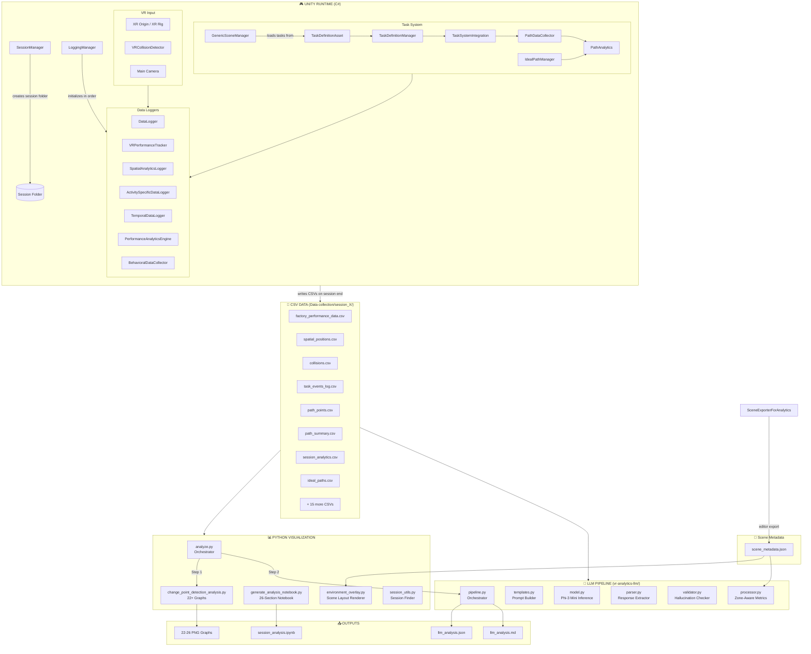
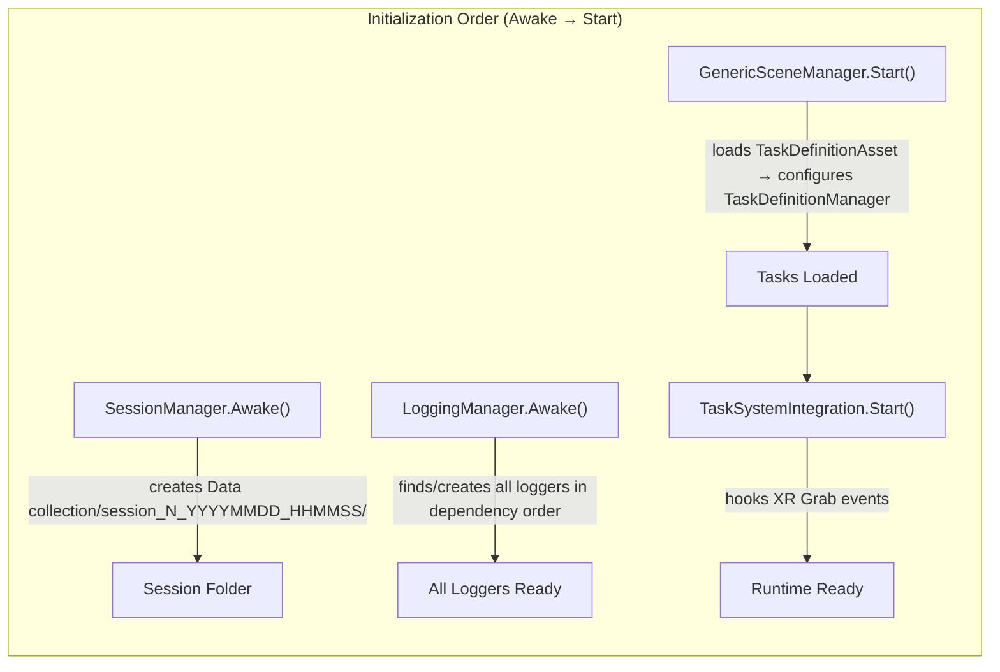
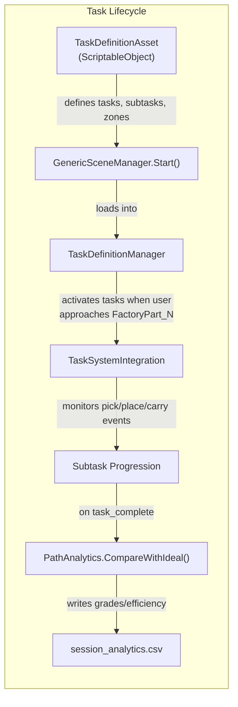
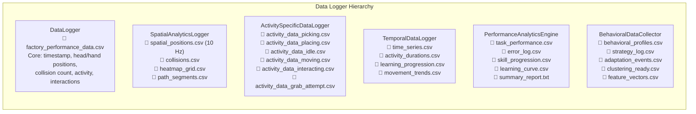
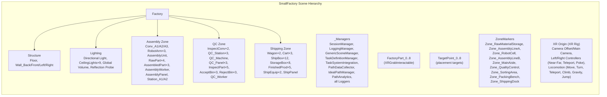
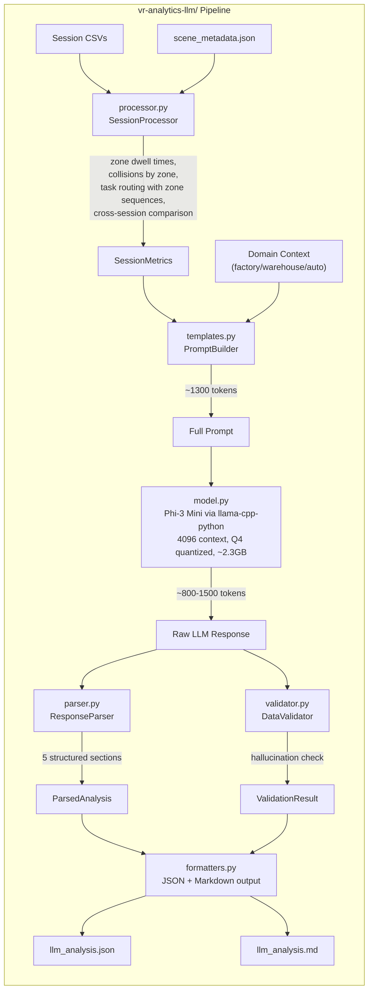
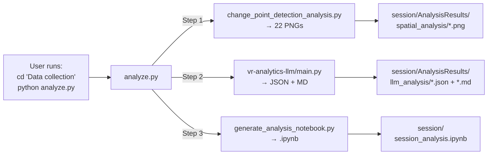

# VR Training Analytics — Complete System Architecture

> **Project**: VR Factory Training with Data Collection, Visualization & LLM Analysis  
> **Engine**: Unity 6000.0.47f1 (URP) with XR Interaction Toolkit  
> **Scene**: `SmallFactory.unity` — a production-floor training environment  
> **Last Updated**: 2025

---

## Table of Contents

1. [System Overview](#1-system-overview)
2. [High-Level Architecture Flowchart](#2-high-level-architecture-flowchart)
3. [Unity Runtime Layer (C#)](#3-unity-runtime-layer-c)
   - 3.1 [Session & Initialization](#31-session--initialization)
   - 3.2 [VR Tracking & Input](#32-vr-tracking--input)
   - 3.3 [Task System](#33-task-system)
   - 3.4 [Data Logging Pipeline](#34-data-logging-pipeline)
   - 3.5 [Scene & Environment](#35-scene--environment)
4. [Data Output Layer (CSV Files)](#4-data-output-layer-csv-files)
5. [Python Visualization Pipeline](#5-python-visualization-pipeline)
6. [LLM Analysis Pipeline](#6-llm-analysis-pipeline)
7. [Orchestration Layer](#7-orchestration-layer)
8. [File Structure Reference](#8-file-structure-reference)
9. [Detailed Component Reference](#9-detailed-component-reference)

---

## 1. System Overview

The system is a **three-stage pipeline**:

| Stage | Technology | Purpose |
|-------|-----------|---------|
| **Stage 1: Data Collection** | Unity C# (runtime) | VR session capture: head/hand tracking, collisions, task events, spatial positions |
| **Stage 2: Graphical Analysis** | Python (matplotlib, scipy, sklearn) | 22+ PNG visualizations + Jupyter notebook from CSV data |
| **Stage 3: LLM Interpretation** | Python + Phi-3 Mini (llama-cpp) | Zone-aware natural-language analysis with domain knowledge |

These stages are **completely independent** — Stage 2 and Stage 3 share the same CSV input files but never interact with each other.

---

## 2. High-Level Architecture Flowchart



---

## 3. Unity Runtime Layer (C#)

### 3.1 Session & Initialization



#### `SessionManager` (`SessionManager.cs`)
- **Singleton** — one instance per play session
- Creates the session folder at `Data collection/session_N_YYYYMMDD_HHMMSS/`
- Auto-detects session number by scanning existing folders
- Creates subdirectories: `SpatialData/`, `TemporalData/`, `BehavioralData/`, `ClusteringData/`, `PerformanceMetrics/`
- All loggers call `SessionManager.GetSessionFolder()` to know where to write CSVs
- Persists across scene loads (`DontDestroyOnLoad`)

#### `LoggingManager` (`LoggingManager.cs`)
- **Singleton** — initializes all data loggers in the correct dependency order
- Initialization order:
  1. `DataLogger` (no dependencies)
  2. `VRPerformanceTracker` (depends on DataLogger)
  3. `ActivitySpecificDataLogger` (depends on VRPerformanceTracker)
  4. `SpatialAnalyticsLogger` (depends on VRPerformanceTracker)
  5. `PerformanceAnalyticsEngine` (depends on DataLogger, VRPerformanceTracker)
  6. `TemporalDataLogger` (depends on VRPerformanceTracker, DataLogger)
  7. `BehavioralDataCollector` (depends on all above)
- Prevents circular dependencies by controlling init sequence
- Will auto-create loggers on child GameObjects if they don't exist (`autoCreateLoggers = true`)

#### `SessionFolderHelper` (`SessionFolderHelper.cs`)
- Static utility class
- Provides consistent path resolution for all loggers
- Methods: `GetSessionFolder()`, `GetSubFolder(subfolder)`, `GetTimestamp()`

---

### 3.2 VR Tracking & Input

#### `VRPerformanceTracker` (`VRPerformanceTracker.cs`)
- **Singleton** — central VR state provider
- Auto-detects XR Origin, Main Camera, Left/Right Controllers
- Tracks in real-time:
  - Head position, left/right hand positions
  - Current activity state (`idle`, `moving`, `picking`, `placing`, `interacting`, `grab_attempt`)
  - Collision count (incremented by `VRCollisionDetector`)
  - Cumulative idle time (based on `idleThreshold` — default 2s without movement)
  - Movement speed
- Activity detection logic:
  - `idle`: no significant movement for > `idleThreshold` seconds
  - `moving`: head position changes above `movementThreshold`
  - `picking`/`placing`/`interacting`: set externally by `TaskSystemIntegration` when XR grab events fire
- Other components read from this singleton to get current VR state

#### `VRCollisionDetector` (`VRCollisionDetector.cs`)
- Attached to the XR Rig body (CharacterController)
- Two collision sources:
  1. **Body collisions** — `OnControllerColliderHit` from CharacterController
  2. **Hand collisions** — `OnTriggerEnter` from child `SphereCollider`s added to controllers (`HandCollisionHelper`)
- Collision filtering:
  - Cooldown per-object (`collisionCooldown = 1.5s`)
  - Minimum impact force (`minImpactForce = 0.05`)
  - Name-based ignore list (`Floor`, `Ceiling`, `Ground`, `Terrain`)
  - Layer-based ignore mask
- On collision:
  - Sends haptic impulse to both controllers
  - Increments `VRPerformanceTracker.collisionCount`
  - Logs to `SpatialAnalyticsLogger.LogCollision()`
- Body part identification: `head`, `left_hand`, `right_hand`, `body`

#### `VRTeleportController` (`VRTeleportController.cs`)
- Manages teleport provider integration
- Detects teleportation events and adjusts position tracking accordingly

#### `CameraController` (`CameraController.cs`)
- Fallback camera controller for non-VR testing (desktop mode)
- WASD + mouse look

---

### 3.3 Task System



#### `TaskDefinitionAsset` (`TaskSystem/TaskDefinitionAsset.cs`)
- **ScriptableObject** — created via `Right-click → Create → VR Training → Task Definition`
- Defines:
  - `primaryObjectPrefix` (e.g., `"FactoryPart"`) — the interactable objects
  - `targetObjectPrefix` (e.g., `"TargetPoint"`) — the destination objects
  - `maxObjectIndex` (e.g., `8`) — how many object pairs exist
  - `csvFileName` (e.g., `"factory_performance_data"`)
  - `tasks[]` — array of task entries, each with:
    - `taskNumber`, `primaryObject`, `targetObject`
    - `description` (e.g., "Material Staging: Scan barcode, verify part number, stage at assembly line")
    - `subtasks[]` — ordered list of subtask entries (`navigate`, `scan`, `verify`, `pick`, `carry`, `place`, etc.)
  - `zones[]` — spatial zone definitions with `zoneName`, `center`, `size`

#### `GenericSceneManager` (`GenericSceneManager.cs`)
- Reads the assigned `TaskDefinitionAsset` on `Start()`
- Loads tasks into `TaskDefinitionManager`
- Configures `SpatialAnalyticsLogger` with zone definitions
- Sets `DataLogger.csvFileName` from the asset
- **Environment-agnostic** — works for any scene with any TaskDefinitionAsset

#### `TaskDefinitionManager` (`TaskSystem/TaskDefinitionManager.cs`)
- **Singleton** — runtime task state machine
- Maintains `allTasks: List<TrainingTask>` and `activeTasks: List<TrainingTask>`
- Task activation: when `TaskSystemIntegration` detects the user approaching a `FactoryPart_N`, it calls `ActivateTask(taskNumber)`
- Subtask progression:
  - Each `TrainingTask` has a `List<SubTask>` (navigate, scan, verify, pick, carry, place, etc.)
  - `AdvanceSubtask()` moves to the next subtask, logging events
  - Some subtasks auto-complete (e.g., scan, verify) when the pick/carry event fires
- Fires events: `OnTaskStarted`, `OnTaskCompleted`, `OnSubtaskCompleted`
- Logs all events to `task_events_log.csv` via the event log method

#### `TaskSystemIntegration` (`TaskSystem/TaskSystemIntegration.cs`)
- **Bridge** between XR Interaction Toolkit and the Task System
- Discovers all `XRGrabInteractable` objects whose names match the configured prefix
- Hooks `selectEntered` / `selectExited` events on each interactable
- Proximity detection: checks if user is within `approachDistance` (1.5m) of a primary object → activates the task
- Pick detection: when user grabs a `FactoryPart_N` → starts carry phase, begins path recording
- Place detection: when user releases near a `TargetPoint_N` → checks placement accuracy against `placementThreshold` (1.2m)
  - If correct: completes the task
  - If incorrect: logs `place_retry` event, user must try again
- Notifies `PathDataCollector` to start/stop path recording

#### `PathDataCollector` (`TaskSystem/PathDataCollector.cs`)
- Records movement paths during tasks
- Two path types per task:
  - `navigation` — walking to the pickup point
  - `carry` — carrying the object to the target
- Records `PathPoint` objects at each frame: position3D, position2D, head/hand positions, speed, distance from start/target
- On task completion, writes:
  - `path_points_TIMESTAMP.csv` — all individual path points
  - `path_summary_TIMESTAMP.csv` — per-path aggregates (total distance, efficiency, duration, etc.)
- Groups points by `PathId` = `{type}_Task_{N}_{timestamp}`

#### `IdealPathManager` (`TaskSystem/IdealPathManager.cs`)
- Computes ideal (shortest) paths between every FactoryPart→TargetPoint pair
- Uses Unity's `NavMesh` if available, otherwise straight-line distance
- Generates waypoints along the ideal path
- Writes `ideal_paths_TIMESTAMP.csv`
- Used by `PathAnalytics` for efficiency/deviation comparisons

#### `PathAnalytics` (`TaskSystem/PathAnalytics.cs`)
- Compares actual paths (from `PathDataCollector`) against ideal paths (from `IdealPathManager`)
- Computes per-task:
  - `actualDistance`, `idealDistance`, `excessDistance`
  - `distanceEfficiency` (%) = ideal / actual × 100
  - `averageDeviation`, `maxDeviation`, `minDeviation`, `deviationStdDev`
  - `averageSpeed`, `maxSpeed`
  - `overallScore` (0-100) and `performanceGrade` (A/B/C/D/F)
- Grade thresholds: A ≥ 95, B ≥ 85, C ≥ 75, D ≥ 60, F < 60
- Writes `session_analytics_TIMESTAMP.csv`

#### `TrainingTaskUI` / `InteractableObjectUI` (`TaskSystem/`)
- In-world UI: floating task list, subtask checkmarks, progress indicators
- `InteractableObjectUI`: tooltip labels on FactoryPart objects showing task info

---

### 3.4 Data Logging Pipeline



#### `DataLogger` (`DataLogger.cs`)
- **Core logger** — writes the main `factory_performance_data_TIMESTAMP.csv`
- Logs at configurable interval (`loggingInterval = 0.1s` = 10 Hz)
- Each row: `SessionTime`, `HeadX/Y/Z`, `LeftControllerX/Y/Z`, `RightControllerX/Y/Z`, `ActivityLabel`, `CollisionCount`, `IdleTime`, `InteractionType`, `ObjectID`, `InteractionX/Y/Z`
- Buffered writes — flushes to disk periodically and on `OnApplicationQuit`

#### `SpatialAnalyticsLogger` (`SpatialAnalyticsLogger.cs`)
- High-frequency spatial data at `spatialLoggingFrequency` Hz (default 10)
- Writes to `SpatialData/` subfolder:
  - `spatial_positions.csv`: HeadX/Y/Z, HeadRotation, GazeDirection, LeftHand/RightHand positions and velocities, MovementSpeed, **CurrentZone**
  - `collisions.csv`: CollisionX/Y/Z, CollisionObject, BodyPart, CollisionForce, CollisionNormal, CollisionType
  - `heatmap_grid.csv`: Pre-aggregated grid-based visit counts (GridX, GridZ, VisitCount)
  - `path_segments.csv`: Movement segments with start/end positions, distance, speed, task context
- **Zone tracking**: maintains a list of `SpatialZone` objects (loaded from `GenericSceneManager`). Each spatial position is tested against zone bounds to determine `CurrentZone`.

#### `ActivitySpecificDataLogger` (`ActivitySpecificDataLogger.cs`)
- Logs detailed data for each activity type in separate CSV files
- Six activity CSVs in session root:
  - `activity_data_picking.csv`: pickingMethod, reachDistance, successfulGrab, grabAttempts
  - `activity_data_placing.csv`: placementAccuracy, correctPlacement, placementMethod, stabilityScore
  - `activity_data_idle.csv`: idle duration, positions
  - `activity_data_moving.csv`: movement speed, direction
  - `activity_data_interacting.csv`: interaction type, object
  - `activity_data_grab_attempt.csv`: grab success/failure, distance

#### `TemporalDataLogger` (`TemporalDataLogger.cs`)
- Time-series analytics in `TemporalData/` subfolder:
  - `time_series.csv`: SessionTime, ActivityType, PerformanceScore, MovementSpeed, ReactionTime, ErrorsInWindow, CognitiveLoad
  - `activity_durations.csv`: per-activity start/end/duration with transitions
  - `learning_progression.csv`: SkillLevel snapshots over time, PlateauIndicator
  - `movement_trends.csv`: windowed movement statistics

#### `PerformanceAnalyticsEngine` (`PerformanceAnalyticsEngine.cs`)
- Task-level performance metrics in `PerformanceMetrics/` subfolder:
  - `task_performance.csv`: per-task CompletionTime, Successful, Accuracy, ErrorCount, Efficiency
  - `error_log.csv`: ErrorType (misplacement, collision, drop, wrong_object, timeout), Severity, Location, Recovery
  - `skill_progression.csv`: per-assessment-window SuccessRate, AvgAccuracy, ErrorRate, ImprovementRate
  - `learning_curve.csv`: per-task Accuracy and MovingAverage
  - `summary_report.txt`: human-readable session summary

#### `BehavioralDataCollector` (`BehavioralDataCollector.cs`)
- ML-ready behavioral analysis in `BehavioralData/` and `ClusteringData/` subfolders:
  - `behavioral_profiles.csv`: AverageSpeed, AverageAccuracy, SuccessRate, MovementSmoothness, PathEfficiency, DecisionSpeed, Adaptability, DominantStrategy, etc.
  - `strategy_log.csv`: StrategyName, Confidence, Features
  - `adaptation_events.csv`: EventType, metric changes, trigger conditions
  - `clustering_ready.csv`: Standardized feature matrix ready for clustering algorithms
  - `feature_vectors.csv`: Raw multi-dimensional feature vectors per time window

#### `RealTimeAnalytics` (`RealTimeAnalytics.cs`)
- In-VR analytics display (optional UI overlay)
- Reads from VRPerformanceTracker to show real-time:
  - Efficiency slider, collision rate, spatial/performance/temporal/behavioral metrics
  - Text feedback ("Excellent performance", "Watch for collisions", etc.)

---

### 3.5 Scene & Environment

#### Scene: `SmallFactory.unity`



#### Zone Layout (Top-Down)

```
    ┌─────────────────────────────────────────────────┐
    │                 FACTORY FLOOR (20.5m × 18.5m)    │
    │                                                   │
    │  ┌──────────┐ ┌────────────┐ ┌─────┐ ┌────────┐ │
    │  │ Raw Mat. │ │ Assembly   │ │Robot│ │Assembly│ │  Z=0..6
    │  │ Storage  │ │ Line A     │ │Cell │ │Line B  │ │
    │  │          │ │            │ │HAZD │ │        │ │
    │  └──────────┘ └────────────┘ └─────┘ └────────┘ │
    │  ─────────────── Main Aisle ──────────────────── │  Z≈6..7
    │  ┌─────────────────────────┐ ┌──────────────────┐│
    │  │  Quality Control        │ │ Sorting Area     ││  Z=7..12
    │  │                         │ │                  ││
    │  └─────────────────────────┘ └──────────────────┘│
    │  ┌─────────────────────────┐ ┌──────────────────┐│
    │  │  Packing Bench          │ │ Shipping Dock    ││  Z=12..17
    │  │                         │ │                  ││
    │  └─────────────────────────┘ └──────────────────┘│
    │  X=0                                        X=20 │
    └─────────────────────────────────────────────────┘
```

Production flow: **Raw Material Storage → Assembly Lines → (Robot Cell) → Quality Control → Sorting → Packing → Shipping Dock**

#### `SceneExporterForAnalytics` (`SceneExporterForAnalytics.cs`)
- **Editor-only** tool (`VR Analytics > Export Scene for Configuration`)
- Scans the scene hierarchy and writes `scene_metadata.json`:
  - All objects with positions, bounds, tags, components
  - `spatial_regions[]` with zone center/size for each `ZoneMarkers/Zone_*` child
  - `tagged_objects` grouped by tag (Ground, Obstacle, etc.)
  - `interactables[]` list
- This JSON is consumed by:
  - `environment_overlay.py` (draws scene layout on matplotlib graphs)
  - `processor.py` in the LLM pipeline (maps collisions/positions to zones)

#### `_ManagersTemplate.prefab`
- Prefab containing all manager components pre-configured
- Created via `VR Training > Create Managers Prefab` menu (`CreateManagersPrefab.cs`)

---

## 4. Data Output Layer (CSV Files)

A single VR session produces the following folder structure:

```
Data collection/
  session_1_20260324_132914/
  │
  │── factory_performance_data_TIMESTAMP.csv    ← DataLogger (core)
  │── session_analytics_TIMESTAMP.csv           ← PathAnalytics (task grades)
  │── task_events_log_TIMESTAMP.csv             ← TaskDefinitionManager (all events)
  │── path_points_TIMESTAMP.csv                 ← PathDataCollector (movement paths)
  │── path_summary_TIMESTAMP.csv                ← PathDataCollector (path aggregates)
  │── ideal_paths_TIMESTAMP.csv                 ← IdealPathManager (reference paths)
  │
  │── activity_data_picking_TIMESTAMP.csv       ← ActivitySpecificDataLogger
  │── activity_data_placing_TIMESTAMP.csv       ← ActivitySpecificDataLogger
  │── activity_data_idle_TIMESTAMP.csv          ← ActivitySpecificDataLogger
  │── activity_data_moving_TIMESTAMP.csv        ← ActivitySpecificDataLogger
  │── activity_data_interacting_TIMESTAMP.csv   ← ActivitySpecificDataLogger
  │── activity_data_grab_attempt_TIMESTAMP.csv  ← ActivitySpecificDataLogger
  │
  │── SpatialData/
  │   ├── spatial_positions_TIMESTAMP.csv       ← SpatialAnalyticsLogger
  │   ├── collisions_TIMESTAMP.csv              ← SpatialAnalyticsLogger
  │   ├── heatmap_grid_TIMESTAMP.csv            ← SpatialAnalyticsLogger
  │   └── path_segments_TIMESTAMP.csv           ← SpatialAnalyticsLogger
  │
  │── TemporalData/
  │   ├── time_series_TIMESTAMP.csv             ← TemporalDataLogger
  │   ├── activity_durations_TIMESTAMP.csv      ← TemporalDataLogger
  │   ├── learning_progression_TIMESTAMP.csv    ← TemporalDataLogger
  │   └── movement_trends_TIMESTAMP.csv         ← TemporalDataLogger
  │
  │── PerformanceMetrics/
  │   ├── task_performance_TIMESTAMP.csv        ← PerformanceAnalyticsEngine
  │   ├── error_log_TIMESTAMP.csv               ← PerformanceAnalyticsEngine
  │   ├── skill_progression_TIMESTAMP.csv       ← PerformanceAnalyticsEngine
  │   ├── learning_curve_TIMESTAMP.csv          ← PerformanceAnalyticsEngine
  │   └── summary_report_TIMESTAMP.txt          ← PerformanceAnalyticsEngine
  │
  │── BehavioralData/
  │   ├── behavioral_profiles_TIMESTAMP.csv     ← BehavioralDataCollector
  │   ├── strategy_log_TIMESTAMP.csv            ← BehavioralDataCollector
  │   └── adaptation_events_TIMESTAMP.csv       ← BehavioralDataCollector
  │
  └── ClusteringData/
      ├── clustering_ready_TIMESTAMP.csv        ← BehavioralDataCollector
      └── feature_vectors_TIMESTAMP.csv         ← BehavioralDataCollector
```

**Total: ~28 CSV files per session** across 5 subdirectories + session root.

---

## 5. Python Visualization Pipeline

```mermaid
flowchart LR
    subgraph INPUT["Input"]
        CSV["Session CSVs"]
        META["scene_metadata.json"]
    end

    subgraph VIZ["change_point_detection_analysis.py"]
        direction TB
        G01["01: Head Movement (4 views)"]
        G02["02: Hand Controller Movement"]
        G03["03: Collision Hotspots"]
        G04["04: Spatial Occupancy & Activity"]
        G05["05: Environment Overlay"]
        G06["06: Comprehensive Dashboard"]
        G07["07: All Task Paths"]
        G08["08: Task Performance Metrics"]
        G09["09: Individual Task 3D Paths"]
        G10["10: Task Perf Dashboard"]
        G11["11: Task Event Timeline"]
        G12["12: Individual Task Paths 2D"]
        G13["13: K-Means Clustering"]
        G14["14: Behavior Spatial Map"]
        G15["15: Behavior Features"]
        G16["16: Change Point Analysis"]
        G17["17: Learning Progression"]
        G18["18: Subtask Analysis"]
        G19["19: Learning Curve & Skill"]
        G20["20: Behavioral Profile"]
        G21["21: Heatmap Grid"]
        G22["22: Temporal Performance"]
        G23["23: Activity Duration Transitions"]
        G24["24: Path Segments"]
        G25["25: Activity Pick/Place"]
        G26["26: Feature Vector Clustering"]
    end

    CSV --> VIZ
    META --> |optional overlay| VIZ
    VIZ --> |"22-26 PNGs → session/AnalysisResults/spatial_analysis/"| OUT["PNG Files"]
```



### Files

| File | Role |
|------|------|
| `change_point_detection_analysis.py` | Main pipeline: generates 22-26 PNG visualizations. Uses matplotlib, scipy, sklearn (K-Means). Each graph has its own guard clause — skips gracefully if required data is missing. Graphs 23-26 are conditionally generated based on data availability. |
| `generate_analysis_notebook.py` | Generates `session_analysis.ipynb` with 26 interactive sections (superset of PNGs). Run in Jupyter for interactive exploration. |
| `environment_overlay.py` | `EnvironmentOverlay` class: loads `scene_metadata.json`, draws floor/walls/zones/equipment as matplotlib backgrounds. Used by graphs 5, 7, 12, 14 for spatial context. |
| `session_utils.py` | Utilities: `get_latest_session_folder()`, `get_session_from_args()`, `find_latest_file()`, `create_notebook_with_images()`. |

### Key Algorithms

| Graph | Algorithm | Library |
|-------|-----------|---------|
| 3, 5, 6 | Kernel Density Estimation (collision hotspots) | `scipy.stats.gaussian_kde` |
| 4 | Hexbin occupancy heatmap | `matplotlib.axes.hexbin` |
| 13-15 | K-Means clustering (efficient vs inefficient movement) | `sklearn.cluster.KMeans` |
| 17 | Change point detection (speed profile analysis) | Custom rolling-window deviation |
| 16 | Activity transition detection | Consecutive-difference scan |

---

## 6. LLM Analysis Pipeline



### Components

#### `processor.py` — Zone-Aware Data Processing
- **`SessionProcessor`** class: reads all session CSVs and computes:
  - **Original metrics**: distance, speed, collisions, task counts, activity time, idle%, grades
  - **NEW — Zone dwell times**: reads `CurrentZone` column from `spatial_positions.csv`, computes time per zone
  - **NEW — Collisions by zone**: maps each collision coordinate to a zone (via `scene_metadata.json` bounds or spatial_positions timestamp matching)
  - **NEW — Task routing**: for each task, traces the zone sequence from spatial data, detects backtracking and hazard zone detours, counts placement retries
  - **NEW — Cross-session comparison**: loads previous session's analytics, computes delta for efficiency, collisions, hazard dwell, deviation, grades
- Zone classification: each zone name is classified as `hazard`, `transit`, `storage`, `qc`, `shipping`, `assembly`, or `other` based on keyword matching

#### `templates.py` — Prompt Construction
- **System prompt**: instructs the LLM to be a VR Training Analyst, emphasizes grounding in data, defines 5-section output format
- **Domain context**: compact description of the factory/warehouse environment with zone purposes and performance thresholds
- **Data section**: formatted text block containing:
  - Session overview (duration, distance, speed)
  - Collisions by zone with hazard flags
  - Zone dwell times with percentages
  - Task performance overview (grades, efficiency, retries)
  - Per-task routing details (zone sequences, backtracking, hazard detours)
  - Activity breakdown
  - Cross-session comparison (if available)
- **Instruction**: requests 5 sections:
  1. Performance Summary
  2. Safety Analysis (zone-specific collision analysis)
  3. Task Routing Analysis (per-task routing efficiency)
  4. Strengths and Recommendations
  5. Behavioral Pattern Classification (METHODICAL / EFFICIENT / EXPLORATORY / CAUTIOUS / IMPULSIVE)

#### `model.py` — LLM Inference
- **`LLMInference`** class (aliased as `LLMModel`)
- Wraps `llama-cpp-python` for Phi-3 Mini GGUF inference
- Configuration: 4096 context, 20 GPU layers (RTX 4060 optimization), Q4 quantization
- Context manager support (`with LLMModel() as model:`)
- Retry logic (3 attempts with delay)
- Streaming support

#### `parser.py` — Response Extraction
- **`ResponseParser`** class: uses regex patterns to extract 5 structured sections from LLM output
- Extracts: `performance_summary`, `safety_analysis`, `task_routing_analysis`, `strengths`, `recommendations`, `behavioral_pattern` (type + confidence + justification)
- Handles format variations (different heading styles, bullet markers)

#### `validator.py` — Hallucination Detection
- **`DataValidator`** class: cross-checks numbers cited in LLM response against source metrics
- Extracts all numbers from response text, compares against known data values
- Flags mismatches where cited numbers don't appear in source data
- Tolerances for rounding differences

#### `pipeline.py` — Orchestration
- **`AnalysisPipeline`** class: chains all steps:
  1. `SessionProcessor.process()` → metrics
  2. `PromptBuilder.build_prompt()` → prompt
  3. `LLMModel.generate()` → raw response
  4. `ResponseParser.parse()` → structured sections
  5. `DataValidator.validate()` → hallucination check
- Returns `PipelineResult` with all data for JSON serialization
- Batch mode: loads model once, processes multiple sessions

#### `formatters.py` — Output Formatting
- `save_analysis_json()`: writes complete result to JSON
- `format_analysis_markdown()`: converts to readable Markdown
- `print_analysis_console()`: console-friendly output

---

## 7. Orchestration Layer



### `analyze.py` — Unified Entry Point

```
cd "Data collection"
python analyze.py                                  # Latest session, all steps
python analyze.py session_1_20260324_132914         # Specific session
python analyze.py --no-llm                          # Graphs only
python analyze.py --no-viz                          # LLM only
```

- Auto-detects latest session via `session_utils.py`
- Calls `change_point_detection_analysis.py` as subprocess
- Calls `vr-analytics-llm/main.py` as subprocess (uses its own venv if available)
- Auto-detects domain from `scene_metadata.json`
- All outputs land **inside the session folder**

---

## 8. File Structure Reference

```
Project Root/
├── Assets/
│   ├── Scripts/
│   │   ├── SessionManager.cs              # Session folder creation
│   │   ├── LoggingManager.cs              # Logger initialization orchestrator
│   │   ├── GenericSceneManager.cs         # Scene → TaskDefinitionAsset bridge
│   │   ├── DataLogger.cs                  # Core performance CSV logger
│   │   ├── VRPerformanceTracker.cs        # VR state provider (singleton)
│   │   ├── VRCollisionDetector.cs         # Collision detection + haptics
│   │   ├── SpatialAnalyticsLogger.cs      # Spatial positions, collisions, heatmaps
│   │   ├── ActivitySpecificDataLogger.cs  # Per-activity detail CSVs
│   │   ├── TemporalDataLogger.cs          # Time-series and trend CSVs
│   │   ├── PerformanceAnalyticsEngine.cs  # Task metrics, errors, skill progression
│   │   ├── BehavioralDataCollector.cs     # Behavioral profiles, strategies, clustering
│   │   ├── RealTimeAnalytics.cs           # In-VR analytics UI
│   │   ├── SceneExporterForAnalytics.cs   # Editor: exports scene_metadata.json
│   │   ├── SessionFolderHelper.cs         # Path resolution utility
│   │   ├── VRTeleportController.cs        # Teleport handling
│   │   ├── CameraController.cs            # Desktop camera (non-VR)
│   │   ├── HDRPLightingSetup.cs           # Lighting configuration
│   │   ├── LightRangeSetter.cs            # Light range utility
│   │   └── TaskSystem/
│   │       ├── TaskDefinitionAsset.cs     # ScriptableObject: task definitions
│   │       ├── TaskDefinitionManager.cs   # Runtime task state machine
│   │       ├── GenericSceneManager.cs     # (loaded via root GenericSceneManager)
│   │       ├── TaskSystemIntegration.cs   # XR ↔ Task bridge
│   │       ├── PathDataCollector.cs       # Path recording during tasks
│   │       ├── IdealPathManager.cs        # NavMesh ideal path computation
│   │       ├── PathAnalytics.cs           # Path comparison + grading
│   │       ├── TrainingTaskUI.cs          # In-world task UI
│   │       └── InteractableObjectUI.cs    # Object tooltip UI
│   ├── Editor/
│   │   ├── CreateManagersPrefab.cs        # Menu: create _Managers prefab
│   │   ├── VRTrainingMenu.cs              # Custom menu items
│   │   ├── AddFactoryColliders.cs         # Utility: add colliders to factory objects
│   │   └── TaskDefinitionAssetEditor.cs   # Custom inspector for TaskDefinitionAsset
│   ├── Prefabs/
│   │   └── _ManagersTemplate.prefab       # Pre-configured managers prefab
│   ├── SmallFactory.unity                 # Main training scene
│   └── ARCHITECTURE.md                    # This file
│
├── Data collection/
│   ├── analyze.py                         # Unified orchestrator
│   ├── change_point_detection_analysis.py # 22+ graph visualization pipeline
│   ├── generate_analysis_notebook.py      # Jupyter notebook generator
│   ├── environment_overlay.py             # Scene layout renderer for matplotlib
│   ├── session_utils.py                   # Session finder utilities
│   ├── scene_metadata.json                # Exported scene layout data
│   └── session_N_YYYYMMDD_HHMMSS/         # Session data folders
│       ├── AnalysisResults/
│       │   ├── spatial_analysis/*.png     # Generated graphs
│       │   └── llm_analysis/*.json,*.md   # LLM analysis output
│       └── (28 CSV files across 5 subdirectories)
│
└── vr-analytics-llm/
    ├── main.py                            # LLM CLI entry point
    ├── config/
    │   └── settings.py                    # Model config, hardware, domains
    ├── src/
    │   ├── data/processor.py              # Zone-aware metrics computation
    │   ├── prompts/templates.py           # Prompt construction
    │   ├── llm/model.py                   # Phi-3 Mini inference wrapper
    │   ├── analysis/
    │   │   ├── pipeline.py                # Full analysis orchestration
    │   │   ├── parser.py                  # LLM response extraction
    │   │   └── validator.py               # Hallucination detection
    │   └── output/formatters.py           # JSON/Markdown/Console output
    └── models/                            # Downloaded GGUF model files
```

---

## 9. Detailed Component Reference

### Singleton Components (runtime)

| Singleton | Access | Created By |
|-----------|--------|-----------|
| `SessionManager.Instance` | Static | Self (Awake) |
| `LoggingManager.Instance` | Static | Self (Awake) |
| `DataLogger.Instance` | Static | LoggingManager |
| `VRPerformanceTracker.Instance` | Static | LoggingManager |
| `TaskDefinitionManager.Instance` | Static | Self (Awake) |
| `TaskSystemIntegration.Instance` | Static | Self (Awake) |
| `ActivitySpecificDataLogger.Instance` | Static | LoggingManager |
| `SpatialAnalyticsLogger.Instance` | Static | LoggingManager |
| `PerformanceAnalyticsEngine.Instance` | Static | LoggingManager |
| `TemporalDataLogger.Instance` | Static | LoggingManager |
| `BehavioralDataCollector.Instance` | Static | LoggingManager |

### CSV Column Quick Reference

| CSV File | Key Columns |
|----------|-------------|
| `factory_performance_data` | SessionTime, HeadX/Y/Z, LeftControllerX/Y/Z, RightControllerX/Y/Z, ActivityLabel, CollisionCount, IdleTime, InteractionType, ObjectID |
| `spatial_positions` | SessionTime, HeadX/Y/Z, HeadRotX/Y/Z, GazeX/Y/Z, LeftHandX/Y/Z, RightHandX/Y/Z, MovementSpeed, **CurrentZone** |
| `collisions` | SessionTime, CollisionX/Y/Z, CollisionObject, BodyPart, CollisionForce, CollisionType |
| `task_events_log` | Timestamp, SessionTime, TaskId, TaskNumber, TaskDescription, EventType, PrimaryObjectId, TargetObjectId, EventPosX/Y/Z, UserPosX/Y/Z, TaskState, SubtaskType |
| `path_points` | PathId, TaskNumber, PathType, PosX/Y/Z, Pos2D_X/Z, HeadX/Y/Z, Speed, DistanceFromStart, DistanceToTarget |
| `path_summary` | PathId, TaskNumber, PathType, TotalDistance2D/3D, IdealDistance, PathEfficiency, AverageSpeed, MaxSpeed, Completed |
| `session_analytics` | TaskId, ActualDistance, IdealDistance, ExcessDistance, DistanceEfficiency, AvgDeviation, TotalTime, AvgSpeed, OverallScore, Grade |
| `ideal_paths` | PathId, PrimaryObjectId, TargetObjectId, WaypointIndex, PosX/Y/Z, Pos2D_X/Z |

### LLM Prompt Token Budget

| Section | Approximate Tokens |
|---------|-------------------|
| System prompt | ~300 |
| Domain context (factory) | ~100 |
| Session overview | ~50 |
| Collisions by zone | ~80 |
| Zone dwell times | ~100 |
| Task performance | ~60 |
| Task routing (9 tasks) | ~300 |
| Activity breakdown | ~50 |
| Cross-session comparison | ~120 |
| Instructions | ~200 |
| **Total prompt** | **~1300** |
| **Available for response** | **~2800** |
| **Phi-3 Mini context** | **4096** |
